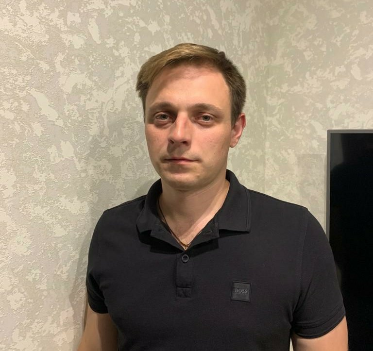

# Android Summer Bootcamp 2020

## Profile

* **Name**: Artem Filatov
* **Discord Username**: TK Artem Filatov
* **Location**: Tomsk, Russia

I am self-employed in the construction industry, but lately I have shown interest in the IT industry. At first I studied python a bit, then I became interested in developing mobile applications for the android platform. My programming experience for about a year, I was very curious to try Kotlin after Java.

 In my free time from my main job, I like reading books, learning something new, I also like playing billiards, volleyball, and am fond of numismatics.

In the future I see myself as an android developer.